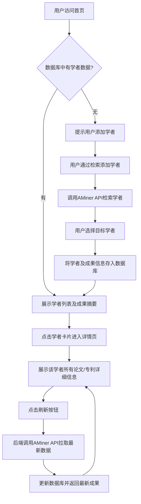

# 科研成果监测平台技术方案设计

## 一、系统整体架构

本平台采用前后端分离的三层架构，具体如下：

- **前端展示层**

  - 负责用户输入、学者检索、成果展示、数据可视化、交互体验。
  - 通过RESTful API与后端通信，所有敏感操作均由后端代理。
  - 支持响应式布局，兼容PC与移动端。
- **后端服务层**

  - 作为API网关，聚合AMiner等外部数据源，统一数据格式。
  - 实现业务逻辑（如分页、筛选、排序、缓存、频控、异常处理）。
  - 预留AI摘要、推送、导出等扩展接口。
  - 负责安全控制（Token管理、权限校验、日志记录）。
  - 支持多环境配置与热更新。
- **数据库持久化层**

  - 引入关系型数据库（推荐PostgreSQL），用于存储学者、论文、专利等信息。
  - 所有学者及其成果数据均持久化，支持高效查询、筛选、分页。
  - 支持数据同步日志、更新时间戳等，便于数据更新与追溯。
- **数据源与AI服务层**

  - AMiner API：学者、论文、专利等数据。
  - AI摘要服务：对成果进行自动摘要、转写（可选OpenAI、国内大模型API）。
  - 未来可扩展更多数据源（如CNKI、专利局API等）。

---

## 二、技术选型

### 1. 前端

- **框架**：React 18 + TypeScript（推荐，类型安全、生态丰富）
- **UI组件库**：Ant Design 5（高效开发、风格统一）
- **状态管理**：Redux Toolkit（全局状态、异步流管理）
- **路由管理**：React Router v6
- **网络请求**：Axios（统一拦截、错误处理、Token注入）
- **可视化**：ECharts（论文/专利趋势、分布、统计图表）
- **表单与校验**：Formik + Yup
- **构建工具**：Vite（极速热更、现代特性）
- **国际化**：react-i18next（预留多语言能力）
- **测试**：Jest + React Testing Library（单元/集成测试）
- **代码规范**：ESLint、Prettier、Husky（提交前校验）

### 2. 后端

- **语言/框架**：Python 3.10+，FastAPI（高性能、类型提示、自动文档）
- **API风格**：RESTful，OpenAPI自动生成接口文档
- **配置管理**：pydantic + python-dotenv（类型安全、环境隔离）
- **异步支持**：uvicorn + async/await（高并发）
- **缓存**：Redis（API结果缓存、频控、会话管理）
- **日志**：loguru（结构化日志、异常追踪）
- **测试**：pytest + httpx（接口/集成测试）
- **安全**：OAuth2/JWT（预留用户认证）、CORS、API限流
- **部署**：Dockerfile、docker-compose、Nginx反向代理、HTTPS
- **CI/CD**：GitHub Actions（自动测试、构建、部署）
- **数据库**：PostgreSQL（推荐，支持JSON字段、全文检索、事务一致性）
- **ORM**：SQLAlchemy（Python）或 Prisma（Node.js）
- **定时任务**：Celery（Python）/ APScheduler，实现数据定时同步

### 3. 数据源与AI服务

- **AMiner API**：已对接，需统一异常处理、重试、速率限制。
- **AI摘要服务**：预留OpenAI/国内大模型API接口，支持异步调用与缓存。
- **扩展性**：所有外部API通过适配器模式封装，便于后续切换/扩展。

### 4. 部署与运维

- **容器化**：前后端、Redis、Nginx均以Docker容器部署，支持一键启动。
- **配置管理**：所有敏感信息、环境变量集中管理，不写死在代码中。
- **监控**：Prometheus + Grafana（接口性能、错误率、资源监控）
- **日志采集**：ELK/EFK（可选，便于生产环境排查）

---

## 三、核心模块设计

### 1. 前端模块

- **学者检索与定位**
  - 输入姓名，支持拼音/中英文模糊搜索。
  - 展示候选学者卡片（姓名、机构、研究方向、头像等）。
  - 支持按机构、研究方向、成果数量等筛选。
  - 选中后进入学者详情页。
- **成果展示**
  - 论文/专利列表，支持分页、排序（时间、引用数等）、关键词过滤。
  - 每条成果可展开查看详细信息（摘要、作者、年份、链接、PDF等）。
  - 支持批量导出、收藏、标记。
- **数据可视化**
  - 论文/专利年度趋势、类型分布、合作网络等图表。
  - 支持交互式筛选与联动。
- **用户体验**
  - 响应式布局，移动端适配。
  - 全局Loading、错误提示、空状态友好展示。
  - 支持主题切换（明暗模式）。
- **接口示例**
  - `GET /api/scholars?name=张三&org=清华&page=1&size=10`
  - `GET /api/scholar/{id}/papers?page=1&size=20`
  - `GET /api/scholar/{id}/patents?page=1&size=20`
- **首页数据展示**
  - 用户进入首页自动加载数据库中所有已存学者及其成果摘要（如论文/专利数量、最新成果等）。
  - 支持分页、筛选、排序，提升大数据量下的可用性。
  - 首页可设计为“学者卡片墙”或“成果总览表”，提升可读性和美观性。
- **学者详情与数据刷新**
  - 点击学者卡片进入详情页，展示该学者所有论文、专利详细信息。
  - 提供“刷新数据”按钮，支持单个学者数据的实时更新。
- **学者检索与新增**
  - “添加学者”入口，输入姓名/机构，调用AMiner检索API，选择目标学者后，系统将其信息及成果拉入本地数据库。
  - 新增后自动跳转到该学者详情页，或在首页列表中高亮显示。

### 2. 后端模块

- **API聚合层**
  - 封装AMiner等外部API，统一异常处理、重试、速率限制。
  - 数据标准化，输出统一格式（如统一作者、机构字段结构）。
- **业务逻辑层**
  - 学者检索、成果拉取、分页、筛选、排序。
  - 支持缓存（如热门学者、常用检索结果）。
  - 论文/专利详情聚合，支持多来源合并。
- **AI摘要服务接口**
  - 预留POST接口，接收成果文本，异步调用大模型API，返回摘要结果。
  - 支持摘要结果缓存，避免重复消耗。
- **配置与安全**
  - Token安全存储，接口权限校验。
  - 请求频控（如IP限流、用户限流）。
  - 全链路日志、异常告警。
- **权限与用户管理（预留）**
  - 用户注册、登录、角色分级（普通用户/管理员）。
  - 操作日志、访问统计。
- **接口示例**
  - `POST /api/ai/summary`（参数：原文，返回：摘要）
  - `GET /api/config`（获取前端展示配置）
- **数据库模型与数据同步（新增）**
  - 设计 `scholars`、`papers`、`patents`、`sync_log`等表，支持一对多关联。
  - 每个学者、成果均有 `updated_at`字段，便于增量同步和前端排序。
  - 实现“手动刷新”与“定时同步”机制，支持单个或批量学者数据的实时更新。
  - 数据同步时采用乐观锁/更新时间戳，避免并发冲突。
- **首页与数据接口**
  - `GET /api/scholars`：分页获取所有学者及其成果摘要。
  - `GET /api/scholar/{id}`：获取单个学者及其全部成果详情。
  - `POST /api/scholar/{id}/refresh`：刷新单个学者数据。
  - `POST /api/scholars/refresh_all`：批量刷新所有学者数据（管理员权限）。

### 3. 数据与AI服务

- **AMiner API适配器**
  - 封装所有AMiner接口，支持参数校验、异常重试、速率限制。
  - 统一数据结构，便于前端消费。
- **AI摘要服务适配器**
  - 支持多种大模型API切换（如OpenAI、DeepSeek、Gemini等）。
  - 支持异步任务队列（如Celery），大模型接口慢时可回调/轮询。
- **扩展点**
  - 预留更多数据源适配器接口（如CNKI、专利局API等）。
- **数据一致性与日志**
  - 每次同步操作写入 `sync_log`，便于追溯和异常排查。

---

## 四、数据流与交互流程

1. **首页数据加载流程**

   - 用户访问首页，前端自动请求 `GET /api/scholars`接口。
   - 后端从数据库分页查询所有学者及其成果摘要，返回前端展示。
   - 用户可筛选、排序、分页浏览。
2. **学者数据刷新流程**

   - 用户在学者详情页点击“刷新数据”，前端调用 `POST /api/scholar/{id}/refresh`。
   - 后端实时拉取AMiner最新数据，更新数据库并返回最新成果。
   - 支持批量刷新（如管理员在后台一键同步所有学者数据）。
3. **学者检索与新增流程（补充）**

   - 用户通过“添加学者”入口，输入姓名/机构，调用AMiner检索API。
   - 选择目标学者后，系统将其信息及成果拉入本地数据库，并自动展示。
4. **AI摘要流程**

   - 用户点击“生成摘要”，前端POST原文至后端AI摘要接口。
   - 后端异步调用大模型API，返回摘要。
   - 前端展示摘要，支持复制、导出。
5. **数据可视化流程**

   - 前端请求统计数据接口，后端聚合成果数据，返回年度趋势、类型分布等。
   - 前端渲染ECharts图表，支持交互筛选。
6. **安全与配置流程**

   - 所有API请求需带Token，后端校验权限。
   - 敏感操作（如AI摘要、导出）需权限校验与频控。
   - 配置项通过后端接口下发，前端动态渲染。

---

## 五、扩展性与安全性设计

- **扩展性**

  - 外部API、AI服务均通过适配器模式封装，便于后续切换/扩展。
  - 前后端均采用模块化设计，支持插件式功能扩展（如成果推送、导出、AI分析等）。
  - 配置项集中管理，支持热更新与多环境切换。
- **安全性**

  - API Token、密钥等敏感信息仅存储于后端环境变量，不写入代码仓库。
  - 所有外部API调用均由后端代理，前端无法直接访问。
  - 支持IP限流、用户限流、接口频控，防止恶意刷接口。
  - 预留用户认证、权限分级、操作日志、异常告警等安全机制。
  - 支持HTTPS全链路加密，防止中间人攻击。
- **配置能力**

  - 环境变量、API密钥、展示字段、主题等均支持集中配置。
  - 配置项通过后端接口下发，前端可动态渲染。
  - 支持灰度发布、A/B测试等高级配置能力。
- **数据更新权限**

  - 数据刷新、批量同步等操作可限制为管理员或登录用户，防止恶意刷接口。

---

## *六、开发与测试规范*

- ***开发规范***

  - *前后端均需详细注释、接口文档（Swagger/OpenAPI、Storybook等）。*
  - *代码风格统一，提交前自动格式化与静态检查。*
  - *采用分支开发、代码评审、自动化测试流程。*
- ***测试策略***

  - *前端：Jest + React Testing Library，覆盖组件、页面、接口交互。*
  - *后端：pytest + httpx，覆盖API、业务逻辑、异常分支。*
  - *集成测试：端到端自动化测试（如Cypress、Playwright）。*
  - *性能测试：接口QPS、响应时延、并发压力测试。*
  - *安全测试：接口权限、Token泄露、SQL注入、XSS等。*
- ***CI/CD流程***

  - *代码提交自动触发单元测试、构建、镜像打包。*
  - *通过后自动部署到测试/生产环境。*
  - *失败自动告警，日志可追溯。*
- ***数据库测试***

  - *所有数据同步、刷新、冲突处理需有单元与集成测试覆盖。*

---

## 开发日志（TDD循环记录）

- 2024-06-10：
  - 按TDD流程，基于需求与技术方案，完成后端学者检索RESTful API（/api/scholars）开发。
  - 设计并实现了覆盖正常、异常、边界、权限等场景的详细测试用例。
  - 测试用例全部通过，接口功能与安全性符合预期。
  - 项目采用venv进行Python环境隔离，依赖管理规范。
  - 代码与测试均有详细注释，接口支持OpenAPI文档。
  - 下一步将继续推进论文/专利检索API、数据库持久化、前端开发等TDD循环。
